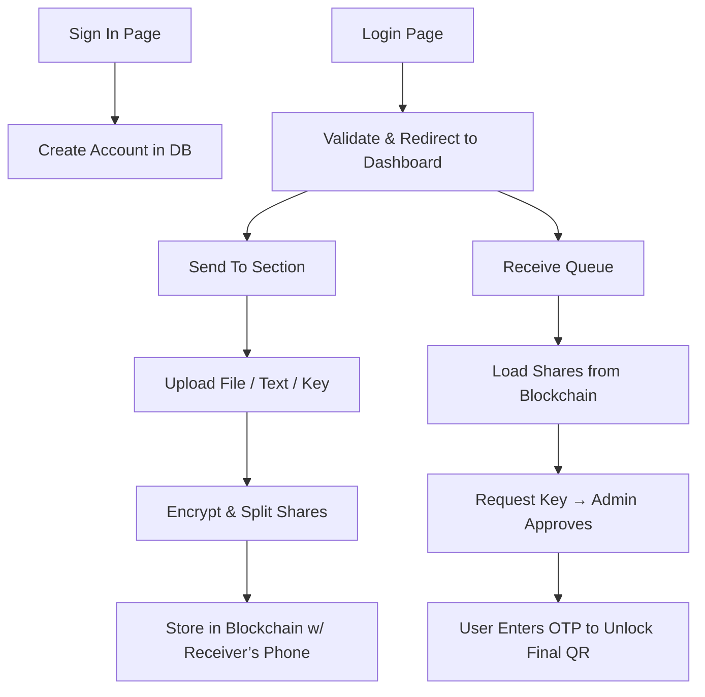

# ✅ YOUR MVP — IN SIMPLE STEPS

## 🧾 1. Sign In / Sign Up Page
User provides:

- 📱 **Phone number**
- 👤 **Username**
- 🔒 **Password** (set during sign-up)

🔹 Store in **database** (with proper hashing for password)

---

## 🔐 2. Login Page
- Use **username + password** to log in

---

## 🧭 3. Dashboard
Once logged in, user lands here. Contains:

### 📤 SEND TO SECTION (for Sender role):
Uploads & Sends shares via blockchain

- **Send To**: 📱 *Phone number input*
- **Upload options**:
  - 📄 **Document** → converted to **QR**
  - 📝 **Text** → converted to **video**
  - 🔑 **Key** → stored in DB (not sent yet)
- **Encrypt & store metadata**
- **Split QR (or encrypted output) into shares**
- **Use blockchain** (or simulated ledger) to record/send shares to receiver’s phone number

### 📥 RECEIVE QUEUE (for Receiver role):
Inbox to see received shares & fetch key

- Shows shares tied to receiver’s phone number
- Shows **Fetch Key** button  
  When clicked:
  - Triggers **admin to send secret key (OTP)** to phone
  - User enters key to **decrypt and show the final QR**
  - Final QR is displayed (merged from shares + key)

---

## 🛠️ TECHNOLOGIES TO USE

| Layer         | Tools                                                                 |
|---------------|-----------------------------------------------------------------------|
| **Frontend**  | HTML, CSS, JavaScript (can use Bootstrap for speed)                  |
| **Backend**   | Python (Flask or FastAPI)                                             |
| **Database**  | SQLite or PostgreSQL                                                  |
| **Auth**      | Flask-Login / JWT                                                     |
| **OTP**       | Twilio API (or dummy SMS logic)                                       |
| **Blockchain**| Simulate with smart contract on Ganache / local Ethereum / Web3.py    |
| **QR/Encrypt**| `qrcode`, `pycryptodome`, `opencv-python`                             |
| **Secret Sharing** | `secretsharing` or Shamir’s algorithm libraries                 |

---

## 🎬 How It Works Together


# 🚀 MVP Tech Stack

| **Feature**       | **Tech Used**                     |
|-------------------|-----------------------------------|
| **Backend API**   | Flask (Python)                    |
| **Auth / DB**     | Supabase (Auth + Postgres DB)     |
| **File Upload**   | Supabase Storage or Base64        |
| **QR Generation** | Python `qrcode` library           |
| **OTP Key Send**  | Twilio (or mock for now)          |
| **Frontend**      | HTML/JS *(optional for now)*      |

---
## FLASK DIRECTORY STRCTURE
```
my_flask_app/
│
├── app.py                # Main Flask app with routes and logic
├── requirements.txt      # Dependencies for Flask and other libraries
├── templates/            # HTML templates
│   └── signup.html       # Sign-up form HTML
├── static/               # Static files (e.g., CSS, JavaScript, Images)
│   └── style.css         # (Optional: CSS file for styling)
├── venv/                 # Virtual environment (created by `python -m venv venv`)
└── config.py             # (Optional: Configurations for Flask and Supabase)
```
---
```
/project-root
│
├── app.py                       # Your main Flask app
├── .env                         # Contains Supabase URL, API key, secret keys
├── templates/
│   ├── login.html
│   ├── signup.html
│   └── dashboard.html
│
├── static/                      # Optional: CSS, JS, uploaded files
│
├── blockchain/
│   ├── __init__.py
│   ├── block.py                 # Blockchain structure and logic
│   └── ledger.json              # Optional: Persisted blockchain ledger
│
├── utils/
│   ├── __init__.py
│   ├── encryption.py            # Encryption/decryption logic
│   └── otp_generator.py         # OTP (optional if using two-step retrieval)
│
└── uploads/                     # Temporarily store uploaded files (encrypted)

```
---

# 🗺️ Roadmap to Achieve Your System

---

## 🔹 PHASE 1: DATABASE & BACKEND SETUP

### 🎯 Your goals:
- Store user data, encrypted shares, keys, and metadata  
- Track the state of send/receive

### ✅ Backend Stack (suggestion):
- **Flask** / **FastAPI** (Python backend)  
- **SQLite** / **PostgreSQL** (Database)  
- **Web3.py** (Simulate blockchain)

### ✅ Example DB Tables (Schema):

| Table       | Fields                                                                 |
|-------------|------------------------------------------------------------------------|
| `users`     | id, username, phone_number, role (sender/receiver), etc.              |
| `messages`  | id, sender_id, receiver_id, data_type, file_path, status              |
| `shares`    | id, message_id, share_index, image_path, is_sent                      |
| `otp_keys`  | id, user_id, otp, expires_at, is_used                                 |
| `ledger`    | tx_id, sender_id, receiver_id, timestamp, share_id                    |

---

## 🔹 PHASE 2: ENCRYPTION & SHARE CREATION

### 🔐 You already have this:
- Generate QR from input `.txt`  
- Scramble + Encrypt QR using **AES**  
- Split into shares (16, or fewer if preferred)  
- Save shares as images locally or on cloud  
- Insert share records into DB

### ✔️ Modify your script to:
- Take `.txt` only  
- Auto-extract data  
- Encrypt and save each share with a message ID  
- Link shares to receiver's phone number  

---

## 🔹 PHASE 3: DASHBOARD UI (HTML + JS)

### 🧩 Dashboard layout:
- **Top bar**: `Welcome, {username}`  
- **Left**: Received queue  
- **Right**: Sender form  

➡️ We’ll build `dashboard.html` in the next step (if you're ready).

---

## 🔹 PHASE 4: BLOCKCHAIN / LEDGER SIMULATION

### ⚙️ Simulate via:
- A **Python dictionary** or **DB table** named `ledger`
- On "send", log each transaction as a "block"

### 🔜 Later enhancements:
- Use **Web3.py** to interact with **Ganache** or **Ethereum testnet**
- Push metadata and IPFS hash of images (if needed)

---

## 🔹 PHASE 5: RECEIVER SIDE FLOW

### 📲 Flow:
1. Receiver sees message from Sender (via queue)  
2. Clicks **“Fetch OTP”**  
3. OTP is generated and sent (simulate via console or SMS)  
4. Receiver enters OTP  
5. System verifies → Reconstructs QR using:
   - All share images tied to message ID  
   - Secret key  
6. Final QR is shown!

---

## 🔹 PHASE 6: IMAGE SHARING STRATEGY

### 🖼️ Since shares are images:
- Save them to `static/shares/`
- Store their paths in DB
- Link them to message + receiver
- Send via "blockchain ledger" by referencing ID/path

> You can convert them to **base64** for blockchain later if desired.
---
